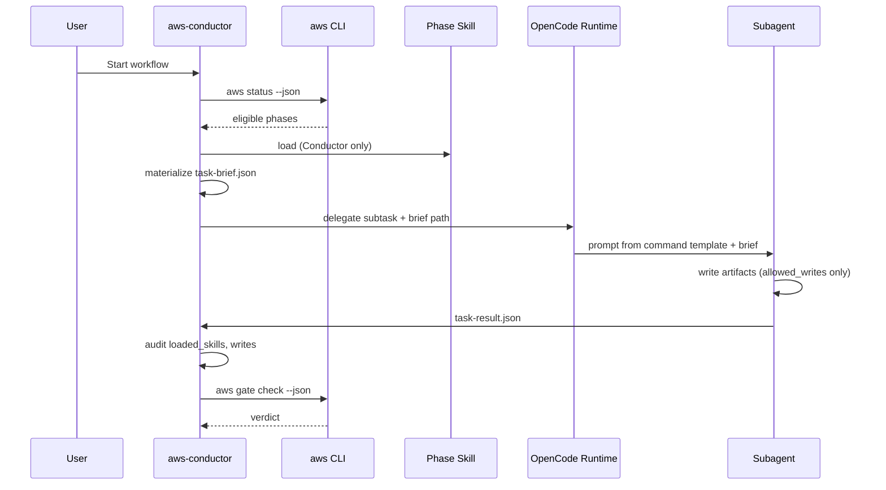

# Hybrid Runtime Boundary

**Date:** 2026-06-17  
**Status:** Approved (PR-0)  
**Related:** [hybrid design spec](../superpowers/specs/2026-06-17-agent-skill-hybrid-design.md), [implementation plan](../superpowers/plans/2026-06-17-agent-skill-hybrid-implementation-plan.md)

---

## Problem

Hybrid mode combines three systems:

1. **AWS CLI** (`aws status`, `aws gate check`, …) — deterministic, no LLM
2. **OpenCode** — Primary/Subagent runtime, commands, permissions
3. **AWS Skills** — phase specifications loaded by Conductor only

Without explicit boundaries, `engine.ts`, `hybrid-phase-map.yaml`, `task-brief.json`, and `aws-workflow` skill will overlap responsibilities and duplicate scheduling logic.

---

## Ownership matrix

| Owner | Owns | Must NOT |
|---|---|---|
| **CLI** (`src/orchestration/engine.ts`, `gate.ts`, `status.ts`, `next-batch-manifest.ts`) | Read phase map + workflow schema + change artifacts; compute phase status; adjudicate gates; emit **next-batch manifest** (eligible phases, reservations, conflicts) | Invoke OpenCode subagents; load Skills; write phase artifacts; call OpenCode APIs |
| **OpenCode Conductor** (`aws-conductor` agent + `aws-workflow` skill) | Load phase Skills; run all `aws *` CLI; materialize `task-brief.json`; delegate subtasks; verify `task-result.json`; enforce direct-run STOP policy | Reimplement gate DSL; replace `aws status` eligibility logic |
| **Subagents** (6 roles) | Execute task brief; write only `allowed_writes`; emit `task-result.json` with audit fields | Load Skills; run `aws *`; infer phase contract from command template alone |
| **OpenCode commands** (`.opencode/commands/*.md`) | Prompt template; OpenCode `agent`/`subtask` routing; direct-run STOP text | Orchestrate workflow; substitute for task brief |
| **Plugin** (`dist/opencode-plugin.mjs`) | Skill path registration; optional hooks/logging/guards | Phase scheduling; subagent delegation |

---

## OpenCode runtime facts (from PR-0 spike)

- Subagents are invoked by the **Primary agent** (Task tool or `@mention`), not by the CLI.
- Commands send a **template prompt** to the LLM; `agent` + `subtask: true` route to subagents ([commands docs](https://opencode.ai/docs/commands/)).
- `permission.skill: deny` on subagents gates the skill tool ([agents docs](https://opencode.ai/docs/agents/)).

---

## Skill-derived brief flow

Only Conductor loads Skills. Subagents are brief-only.

```text
1. Conductor reads hybrid-phase-map.yaml row for phase_id
2. Conductor loads skills/<skill_ref>/SKILL.md
3. Conductor reads .opencode/commands/<command_ref>.md (template + STOP rules)
4. Conductor writes qa/changes/<id>/orchestration/task-brief-<phase>-<seq>.json
   (inlines context/output contracts, allowed_writes, required_outputs)
5. Conductor delegates OpenCode subtask with brief path in message
6. Subagent reads brief only — never loads skill
7. Subagent writes task-result-<phase>-<seq>.json
8. Conductor audits: loaded_skills must be []; writes within allowed_writes
9. Conductor runs aws gate check --phase <gate_after>
```

### Direct-run STOP (commands)

If user runs `/aws-api-plan` (or any phase command) **without** Conductor brief:

| Missing | Action |
|---|---|
| Task brief path in message | STOP — no file writes |
| `change_id` in brief | STOP |
| `allowed_writes` in brief | STOP |

User message (no internal skill names):

> Start from `aws-conductor` and ask it to start the AWS workflow. Phase commands cannot run standalone without a Conductor-generated task brief.

---

## CLI shadow orchestration

Conductor loop uses CLI as **source of truth** for eligibility and gates:

```text
loop:
  manifest = aws orchestration next-batch --change <id> --json   # or Conductor reads equivalent fields
  for each eligible phase in manifest:
    if phase.subagent == conductor: run inline (registry, layer-scan, run, report, …)
    else:
      brief = materializeTaskBrief(phase, changeId)
      delegate subagent(brief.path)
      wait task-result.json
      audit task-result (loaded_skills, writes)
  aws gate check --phase <gate_after> --json
  if stopped: break
```

`engine.ts` / `next-batch-manifest.ts` implement step `manifest` only. They **never** call OpenCode.

---

## Sequence diagram



---

## Non-goals

- `engine.ts` will not import or invoke OpenCode SDK/CLI for subagent dispatch.
- Phase map YAML will not embed OpenCode session IDs or task handles.
- Commands will not embed full Skill markdown — brief carries inlined contracts.
- Plugin will not replace Conductor scheduling.

---

## File responsibilities

| Artifact | Writer | Reader |
|---|---|---|
| `.opencode/hybrid-phase-map.yaml` | Build/init copy | CLI manifest builder, Conductor |
| `task-brief-*.json` | Conductor | Subagent |
| `task-result-*.json` | Subagent | Conductor |
| `orchestration/batches/*.json` | CLI or Conductor (from reservation checker) | Conductor before parallel batches |
| `workflow-state.yaml` | Conductor (via CLI shadow + phase completion) | CLI engine |

---

## Verification

- Unit tests: `next-batch-manifest` never imports opencode paths
- Integration: command fixtures assert STOP without brief
- Spike: [opencode-plugin-matrix.md](../spikes/opencode-plugin-matrix.md)
