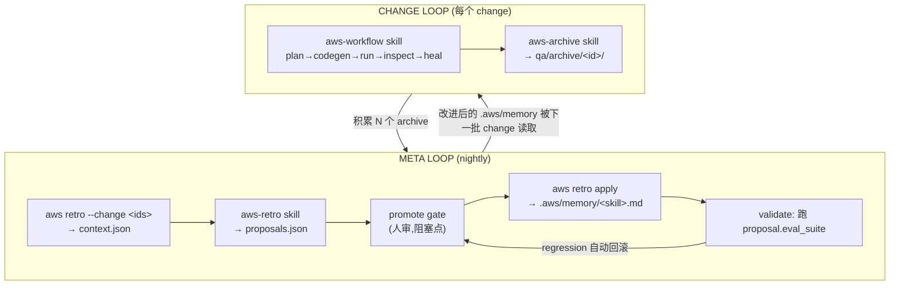

# 自改进 Loop 设计：benchmark 项目上的 workflow 执行 → retro → 持续改进

- 状态：Draft / Proposal
- 目标读者：`aws-workflow` / `aws-archive` / `aws-retro` 维护者；retro CLI（`src/commands/retro.ts`、`src/retro/*`）维护者；eval / CI 维护者
- 关联：`schemas/workflow-schema.yaml`（phase DAG 与 gate 模型）；`engineering/design/state-machine-enforcement.md`（执行期状态机与 `write-scan`）；`skills/aws-retro/SKILL.md`（提案生成契约）；`src/retro/types.ts`（`RetroProposal` / `RetroPromoteRecord`）
- 定位：本文定义一个**跨 change 的自改进闭环**，把「在 benchmark（SUT）上跑 workflow 产生的证据」经 retro 聚合、人审、落地为 `.aws/memory` 规则，并用 eval 验证，使 skills 的表现单调变好。本文**不**重设计单个 change 的执行流程（那是 `workflow-schema.yaml` 的职责），只定义外层 meta loop 及其与内层的接口。

> **设计立场**
> 1. **内外分层，职责互斥**：内层 change loop 只产证据，外层 meta loop 只消费证据产规则。任何一层都不允许 skill 改自己的定义文件（靠 `write-scan` 守卫）。
> 2. **人审门禁,不自动改 memory**：`memory_append` 类提案必须经人显式 promote 才落地；promote 之后的 apply 与 eval 验证全自动。改 skill 仓库文件（`contract_field` / `schema_*`）一律走 PR，不允许 nightly 直接改。
> 3. **时间触发(nightly)**：外层按时间周期跑，而非每个 change 都触发，保证证据积累到"可反思"的量再反思。

---

## 1. 问题陈述

现有能力已就位但**没有闭环**：

- `aws-workflow` skill → 在 change 上跑完整 QA 流程，产出 `qa/changes/<id>/`。
- `aws-archive` skill → 把证据（`events.jsonl`、`inspect/failure-analysis.json`、`healing/`、`workflow-state.yaml`）复制到 `qa/archive/<id>/`。
- `aws retro` 命令 → 聚合 archive 成 `qa/retro/<id>/context.json`。
- `aws-retro` skill → 产出 `proposals.json`（全部 `status: proposed`，从不自动改文件）。
- 各 skill 运行时读 `.aws/memory/<skill>.md`（Per-Skill Memory 契约）。

**缺口**：从 `proposals.json` 到 `.aws/memory/<skill>.md` 的 **promote → apply → validate** 这一段目前是纯手动。`RetroPromoteRecord` 类型已在 `src/retro/types.ts` 定义，但没有对应的 CLI 命令，也没有 nightly 编排把上述步骤串起来。因此 skills 无法从历史证据里自动学习。

---

## 2. 设计目标与非目标

### 目标
1. 定义一个**可重复、幂等**的外层 meta loop，把 archive 证据转化为 `.aws/memory` 规则。
2. **人审只出现在一个阻塞点**（promote gate）；其余阶段（聚合、提案、apply、eval 验证）全自动。
3. 提供**收敛性度量**（signal_count 随规则积累下降）和**防回归兜底**（eval regression 自动回滚）。
4. 补齐最小 CLI 接口（`retro promote` / `retro apply`）与状态文件（`_state.json`），使闭环可落地。

### 非目标
1. 不重设计内层单 change 的 phase DAG / gate（见 `workflow-schema.yaml`）。
2. 不实现全自动 promote（本版明确选择人审门禁）。
3. 不让 nightly 直接改 skill 仓库文件；`contract_field` / `schema_*` 类提案只产出 PR 建议。

---

## 3. 整体结构：内外两层 loop

```
外层 META LOOP(时间触发,跨 change,自改进)
  └─ 内层 CHANGE LOOP(每个 change 一次,产证据)
```

| 层 | 触发 | 执行者 | 产物 | 是否改 skill 仓库 |
|---|---|---|---|---|
| **内层 Change Loop** | 每个需求 | agent 调 `aws-workflow` → `aws-archive` | `qa/archive/<id>/` 证据 | 否（只在 SUT 内） |
| **外层 Meta Loop** | 时间（nightly） | driver 脚本 + 人审 | `.aws/memory/*.md` 更新 + eval 报告 | 是（`memory_append` 在 SUT；其余经人审走 PR） |

核心不变量：**内层只产证据，外层只消费证据产规则，规则回流到内层的下一批 change。**



---

## 4. 内层 Change Loop（接口约束）

外层不重定义内层流程，但对内层的**产物**有硬约束（否则 retro 无输入）。每个**被归档**的 change，其 `qa/archive/<change-id>/` 必须含（注意：execution FAIL / healing exhausted 的 change 不会被归档，因此结构上进不了这个证据池——见 §11 的已知缺口）：

| 文件 | retro 用途 |
|---|---|
| `events.jsonl` | gate pushback、human override、reclassification 信号 |
| `inspect/failure-analysis.json` | failure distribution、top modules |
| `healing/` | healing efficiency 信号 |
| `workflow-state.yaml` | `skill_loaded` 漂移信号（skill execution drift） |

约束：`aws-archive` skill 必须把以上文件复制齐全。缺文件的 change 在外层被标 `evidence_incomplete`，跳过但记账，不阻塞整个 nightly。

---

## 5. 外层 Meta Loop：nightly 阶段序列

一次 nightly run 的阶段：

```
PHASE A  采集窗口(driver 侧,change 清单的唯一权威)
  读 qa/retro/_state.json:以 consumed_changes 为准做去重(结构见 §6,
  记录 source=archive|unarchived,同一 id 允许"先 unarchived 后 archive"
  各消费一次)
  (last_retro_ts 仅用于粗过滤;archived_at 缺 archive-summary.md 时会回退到
   目录 mtime,不可作为去重依据)
  枚举 qa/archive/ 下未消费的 change,逐个校验 §4 的四类文件
  若启用 §11.3 方案 A:同时枚举 qa/changes/ 下未归档的 change——
    terminal 判定由 driver 负责:对每个候选调 aws status --change <id>,
    exit code 10(completed)/20(stopped) 视为终态,0(运行中)剔除。
    workflow-state.yaml 没有 terminal 字段(terminal 是 engine 运行时
    推导的),禁止让 retro reader 自行重实现该推导。
  未归档证据必须快照:driver 把四类文件复制到
    qa/retro/<rid>/evidence/<change-id>/ —— qa/changes/ 是过程目录,
    PHASE D 人审可能持续数天,活目录可能在人审前被清理
  缺证据 → 标 evidence_incomplete,跳过并记账,不进入 PHASE B 的清单

PHASE B  聚合
  aws retro --change <id> ... --retro-id <rid> --json
    → qa/retro/<retro_id>/context.json
  说明:不用 --since——CLI 的 --since 与 --change 互斥,且 --since 模式下 CLI
  自行重扫全部 archive,无法感知 PHASE A 的剔除结果。driver 校验后的 change
  清单必须通过可重复的 --change 显式传入。
  retro_id 由 driver 生成并带时间分量(如 retro-20260708-2130),避免默认
  日粒度 id(retro-YYYYMMDD)在同日二次运行时覆盖已有目录。
  signal_count == 0  →  提前退出,写一条 no-op 记录到 _state.json

PHASE C  提案
  aws-retro skill 读 context.json + 最近 N 个 retro run 的 promotions.json
  (只读历史决策) → proposals.json(全部 status: proposed)
  evidence_ids 指不回 archive 的提案 → skill 侧拒绝(不产出)
  与历史 rejected 提案等价(同 target + 同 problem 语义)的 → 不再产出
  历史 needs_rework 的 → 结合 rework 备注重新起草,而非原样复读

PHASE D  人审门禁(唯一阻塞点)  ← 本版选择
  driver 生成 review 队列(§7),停下等人决策
  人对每条 proposal:promoted / rejected / needs_rework  → 写 promotions.json

PHASE E  apply(仅对 decision=promoted)
  memory_append   → aws retro apply,幂等追加到 .aws/memory/<target>.md
  contract_field  → 只产出 PR 建议(改 skills/*/SKILL.md),不自动改
  schema_*        → 只产出 PR 建议(改 schemas/workflow-schema.yaml),不自动改

PHASE F  自动验证(apply 后立即,仅 memory_append)
  前提:被 apply 的 memory 内容必须以 overlay 方式 seed 进 eval 工作区,
  否则跑 suite 测不到刚 apply 的规则(两工作区隔离问题与机制拍板见 §9)
  按 §6.1 映射选 suite;同一 suite 的多条 proposal 批量对照
  (基线一次 + 含新规则一次,回归判定见 §9)
  不劣于基线 → promotions.json 记 eval_run_id,proposal.status=promoted
              语义是"无害验证"——不证明规则有效,有效性由下一批
              benchmark 的 signal_count 趋势验证(§10)
  劣于基线   → 自动回滚:将对应 memory 块标 deprecated(不物理删除,见 §8),
              proposal.status=needs_rework
              (经 PHASE C 的历史决策回读机制在下一轮重新起草,见上)
```

要点：**人只在 PHASE D 出现**。PHASE E/F 是人点 promote 后自动跑完的，人不必手动跑 eval。

---

## 6. 数据流与文件布局

```
SUT: vue-fastapi-admin/
├── qa/
│   ├── archive/<change-id>/            # 内层证据(retro 输入)
│   │   ├── events.jsonl
│   │   ├── inspect/failure-analysis.json
│   │   ├── healing/
│   │   └── workflow-state.yaml
│   ├── retro/<retro-id>/
│   │   ├── context.json                # aws retro 产出
│   │   ├── proposals.json              # aws-retro 产出(带 status)
│   │   ├── retro-summary.md
│   │   ├── promotions.json             # 人审+验证结果(RetroPromoteRecord[])
│   │   └── evidence/<change-id>/       # 未归档证据快照(PHASE A 复制,
│   │                                   #  人审引用快照而非活的 qa/changes/)
│   └── retro/_state.json               # last_retro_ts + 已消费 change 指针(新增)
└── .aws/memory/
    ├── aws-api-codegen.md              # promoted memory_append 落这里
    ├── aws-e2e-codegen.md
    └── aws-inspect.md                  # 各 skill 运行时读对应文件
                                        # (命名与 skills/ 目录一致,统一 aws- 前缀)
```

`qa/retro/_state.json`（新增）用于**时间触发的幂等性**：`consumed_changes`（按 `(change_id, source)` 去重）是去重的唯一权威（`last_retro_ts` 仅作粗过滤——`archived_at` 在缺 `archive-summary.md` 时回退目录 mtime，被 touch 即漂移，不可靠）。另有两条硬规则：retro_id 必须带时间分量（driver 生成，如 `retro-20260708-2130`），避免 CLI 默认的日粒度 id 在同日二次运行时相互覆盖；**已含 `promotions.json` 的 retro 目录视为不可变**，driver 不得向其中重写 `context.json` / `proposals.json`。建议结构：

```json
{
  "schema_version": "1.1",
  "last_retro_ts": "2026-07-08T00:00:00.000Z",
  "last_retro_id": "retro-20260708-2130",
  "consumed_changes": [
    { "change_id": "RET-dept-management", "source": "unarchived", "consumed_at": "2026-07-08T13:30:00.000Z", "retro_id": "retro-20260708-2130" },
    { "change_id": "RET-user-management", "source": "archive", "consumed_at": "2026-07-08T13:30:00.000Z", "retro_id": "retro-20260708-2130" }
  ]
}
```

消费记录带 `source` 的原因：同一个 change 可能今晚以 `unarchived`（FAIL 终态）身份被消费，之后 healing 修复、重跑通过并被归档——归档版含新证据。去重规则因此是**按 `(change_id, source)` 去重**：`unarchived` 消费过的 id，出现 `qa/archive/<id>/` 后允许以 `archive` 身份再消费一次；反向（先 archive 后 unarchived）不允许。

`apply_kind` 决定落地位置与验证 suite：

| apply_kind | 落地位置 | 验证 suite | nightly 处理 |
|---|---|---|---|
| `memory_append` | SUT `.aws/memory/<target>.md` | 按 §6.1 的 target → suite 映射 | 自动 apply + 自动 eval |
| `contract_field` | `skills/*/SKILL.md` | `workflow-full` | 只产 PR 建议 |
| `schema_param` / `schema_structure` | `schemas/workflow-schema.yaml` | `workflow-full` | 只产 PR 建议 |

### 6.1 memory target → eval suite 映射

`eval/suites/` 现有的 suite 只覆盖部分 skill，不能笼统写成 `workflow-<phase>-codegen`（例如 `workflow-inspect-codegen` 并不存在）。`aws-retro` skill 产 proposal 时必须按下表填 `eval_suite`：

| memory target（skill） | eval_suite | 说明 |
|---|---|---|
| `aws-api-codegen` | `workflow-api-codegen` | 专属 suite |
| `aws-e2e-codegen` | `workflow-e2e-codegen` | 专属 suite |
| `aws-fuzz-codegen` | `workflow-fuzz-codegen` | 专属 suite |
| `aws-performance-codegen` | `workflow-performance-codegen` | 专属 suite |
| `aws-case-design` | `workflow-case` | 专属 suite |
| 执行/运行类（run、healing） | `workflow-run` | 专属 suite |
| 其余（`aws-inspect`、`aws-api-plan`、`aws-e2e-plan` 等） | `workflow-full` | 兜底；无专属 suite，验证信号较粗，后续可按需补建 |

---

## 7. 人审门禁契约（PHASE D）

driver 停在此处，输出**结构化 review 队列**，每条形如：

```
[RETRO-006] layer=agent  target=aws-inspect  apply_kind=memory_append
  problem:  inspect 阶段 skill_loaded=false 出现 2/2 次(skill drift)
  evidence: RET-dept-management, RET-user-management
            (archive 来源指向 qa/archive/<id>/;unarchived 来源指向
             qa/retro/<rid>/evidence/<id>/ 快照——活的 qa/changes/ 可能
             在人审前已被清理,见 §5 PHASE A)
  change:   在 .aws/memory/aws-inspect.md 追加 "启动即校验 skill_md_path…"
  eval:     workflow-full        (aws-inspect 无专属 suite,按 §6.1 兜底)
  risk=low  confidence=high
  decision: [ promoted / rejected / needs_rework ]  ____
```

人的决策写回 `promotions.json`（结构见 `RetroPromoteRecord`）：`proposal_id / decision / decided_by / decided_at`（`eval_run_id` 由 PHASE F 回填）。仅 `decision=promoted` 进 PHASE E。

门禁降噪规则（设计约束）：
- proposal 的 `evidence_ids` 复现次数低于阈值（如 `< 2`）→ driver 默认标 `needs_rework`，不进人审。
- `apply_kind != memory_append` 的提案 → 强制走 PR，nightly 不直接改，只在队列里标注"生成 PR 建议"。

`needs_rework` / `rejected` 的闭环（防死胡同）：promotions.json 只属于产生它的那个 retro run，后续 nightly 不会重访旧队列——如果没有回流机制，同一提案会被无限重生成、无限重标。因此 PHASE C 规定 `aws-retro` skill 必须回读最近 N 个 retro run 的 `promotions.json`（只读）：与历史 `rejected` 等价的提案不再产出；历史 `needs_rework` 的必须结合 rework 备注重新起草（`RetroPromoteRecord` 需为此增加可选的 `rework_note` 字段）。连续 K 轮（建议 K=3）仍被标 `needs_rework` 的同源提案，driver 升级为人审队列里的显式告警，而非继续静默循环。

---

## 8. 需补齐的 CLI 接口（本版仅设计）

```
aws retro --change <id> ... --retro-id <rid>
    现状:--change 已支持(可重复);--retro-id 需新增
    (buildRetroContext 已接受 retroId 参数,只差 CLI 暴露)
    约束:--since 与 --change 互斥(现有行为,保留);nightly driver 一律走
    --change 显式清单模式,--since 仅供人工临时查询

aws retro promote --retro <id> --proposal <pid> --decision <promoted|rejected|needs_rework> --by <who> [--note <text>]
    职责:追加一条 RetroPromoteRecord 到 qa/retro/<id>/promotions.json
    校验:pid 必须存在于该 retro 的 proposals.json,否则报错拒绝
    语义:同一 proposal 出现多条记录时 last-record-wins,apply 只读生效决策
    --note:decision=needs_rework 时写入 rework_note 字段,供 PHASE C 回读
    约束:纯记录人意志,不改任何 memory / skill 文件

aws retro apply --retro <id> [--proposal <pid>]
    职责:只处理 promotions.json 中生效决策=promoted 且 apply_kind=memory_append 的
    target 校验(强制):target 必须匹配白名单模式 `.aws/memory/aws-<skill>.md`
         且 <skill> 在 skills/ 目录中真实存在。target 来自 LLM 生成的
         proposals.json,而 apply 是特权写入口——write-scan 守卫的是 skill
         执行期,管不到这条 CLI 通道,必须在 apply 内自校验
         (validateRetroProposals 同步增加该规则,在 PHASE C 就拦下)
    行为:幂等追加到 .aws/memory/<target>.md,追加块带溯源注释,幂等键为
         retro run id + proposal id 的组合
         (如 <!-- retro:retro-20260708-2130#RETRO-006 evidence:RET-... -->
          注意 proposal id 每轮从 RETRO-001 重新编号,不含 retro id 的键
          会跨轮碰撞:误判"已应用"而跳过,回滚时删错块)
    输出:该 proposal 的 eval_suite 名,供 PHASE F 调用
    约束:遇到 contract_field / schema_* 时只打印 PR 建议,不写 skill 仓库文件
```

设计原则：`promote` 只记录人意志、`apply` 只做 `memory_append` 这一类低风险落地，其余靠 PR —— nightly 因此可全自动跑 A–C 与 E–F，只在 D 卡人。

幂等与回滚要点：

- `apply` 以溯源注释 `retro:<retro-id>#<proposal-id>` 为幂等键；同一 proposal 重复 apply 不产生重复块。
- 回滚（PHASE F regression）**不物理删除**，而是把对应块标 `deprecated:` —— memory 消费契约本来就规定 skill 只应用未标 `deprecated:` 的条目，消费方无需任何改动即可生效。保留块本身有两个价值：审计痕迹（这条规则试过、被 eval 否决）+ PHASE C 回读时能识别"该方向验证失败过"，避免重复起草等价提案。

---

## 9. PHASE F 的验证通路：两工作区隔离问题（必须先打通）

PHASE F 按当前描述有一个致命断层：**`aws retro apply` 写的是活的 SUT 工作区，而 eval 跑 suite 时测的不是它。**

- eval harness 按 `eval/suts.yaml` 的 pinned SHA 克隆 SUT 到独立工作区；
- `.aws/memory/**` 的内容是通过 fixture tier 机制**另行 seed** 进 eval 工作区的，不会从活 SUT 读取，也不提交进 pinned SUT 仓库（见 `README-EVAL.md` "eval runs with an external SUT" 一节）。

因此如果 driver 只是"apply 到活 SUT → 跑 `eval_suite`"，suite 全绿**不代表刚 apply 的 memory 规则有效**——eval 工作区里根本没有这条规则。PHASE F 的"防回归"承诺就成了假信心。

设计要求（PHASE F 的前置条件）：

1. **seed 机制（拍板）**：harness 增加**运行时 overlay 输入**（如 `aws eval run --extra-memory-dir <dir>`）——driver 把本轮 promoted 且已 apply 的 memory 文件放入临时目录，跑 suite 时叠加进 eval 工作区的 `.aws/memory/`。**不允许**把运行时内容写进版本控制的 `eval/fixtures/`：现有 `src/eval/seed_change.ts` 的 fixture tier 是按 dataset case 组织的静态入库资产，塞运行时内容会污染仓库且无法随 retro run 清理。
2. **执行位置与回填**：PHASE F 在 **skills 仓库 checkout** 内执行 `aws eval run --suite <s>`（入口已存在，`src/commands/eval.ts`），不在 SUT 内执行。driver 从 `eval/out/runs/<run-id>/` 取 run id 与 metrics，跨仓库回填到 SUT 侧 `qa/retro/<rid>/promotions.json` 的 `eval_run_id`。
3. **对照组与成本**：同一 suite 的多条 proposal **批量验证**——基线只跑一次（或直接复用 `eval/baselines/` 的既有基线），含新规则的跑一次；不要每条 proposal 各跑一对。回归判定引用 `eval/contracts/p0-metrics.yaml` 的指标集，并为 LLM-judge 类指标设置噪声容差；"不劣于基线"以该指标集 + 容差定义，不用临时拍的绝对阈值。
4. **语义边界**：对照通过只证明**无害**（不回归），不证明规则**有效**——eval suite 跑的是 pinned/synthetic SUT 上的 dataset case，不一定触达产生该证据的 benchmark SUT 的具体失败场景。有效性由下一批 benchmark cycle 的 `signal_count` 趋势验证（§10）。§5 PHASE F 的通过措辞据此为"不劣于基线"，而非"全绿即有效"。
5. 回滚判定用第 3 条的对照结果；回滚动作见 §8（标 `deprecated:`，不物理删除）。

另注：`eval_trend` 信号（`src/retro/eval_trend.ts`）读取的是 `<projectRoot>/eval/out/runs`——`projectRoot` 是 SUT 时该目录不存在，信号恒为空。要让 nightly 报告里有 eval 趋势，driver 需把 skills 仓库的 `eval/out/runs` 路径显式传给聚合（或接受该信号仅在 skills 仓库内运行 retro 时可用）。

---

## 10. 收敛性与安全性

- **收敛信号**：每晚 `context.json` 的 `signal_count`（见 `src/commands/retro.ts` 的 `countSignals`）应随规则积累而下降（同类 failure / drift 复现率降低）。可作为 loop 健康度指标，纳入 nightly 报告。
- **防漂移**：`write-scan`（见 `state-machine-enforcement.md`；`src/eval/write_scan.ts` 的守卫清单含 `.aws/memory/**`）保证内层 skill 不改 `.aws/memory`；只有外层 `apply` 能写，且写前必过人审。
- **防回归**：PHASE F 用 proposal 自带 `eval_suite` 做**对照验证**（前置条件与对照方法见 §9）；回归即自动回滚 → `.aws/memory` 单调变好。
- **幂等**：`_state.json` 的 `consumed_changes`（按 `(change_id, source)` 去重）+ retro 目录不可变规则（同日多次运行不覆盖）+ `apply` 的溯源注释键 `retro:<retro-id>#<proposal-id>`（memory 追加去重），三层共同保证 nightly 可安全重复执行。

---

## 11. 已知设计缺口：FAIL / healing exhausted 的 change 永远进不了 retro 证据池（待决策）

来源：在 `vue-fastapi-admin` benchmark 上实跑 `aws-workflow` → `aws-archive` → `aws retro` 时发现——**execution FAIL 且 healing 耗尽的 change，结构上永远不会被 retro 看到**，与本文 §1 的"持续改进"目标直接冲突。

### 11.1 问题机制

```
execution.status == FAIL 或 healing.status in [exhausted, failed]
        ↓
aws-archive 的 gate 判定不满足 archive 条件 → STOP（不产出 qa/archive/<id>/）
        ↓
aws retro 的 readArchivedChanges() 只扫 qa/archive/ 目录（src/retro/archive_reader.ts）
        ↓
该 change 的证据（events.jsonl / failure-analysis.json / healing/ / workflow-state.yaml）
永远不出现在 context.json 里
        ↓
aws-retro skill 永远看不到、永远不会为它生成 proposal
```

**讽刺之处**：`aggregator.ts::summarizeHealing()` 专门统计 `heal_transition → exhausted` 事件产出 `HealingEfficiencySignal.exhausted`，这正是为"反复 healing 失败"这类场景设计的信号——但因为上游 archive gate 拦截，这个计数在实践中永远是 0。类似地，`skill_execution_signal`（`skill_loaded` 漂移）等信号也只能在"最终 PASS 且被归档"的 change 里被看到，而这些 change 往往恰恰是问题最少的一批。

### 11.2 影响范围

不是本次 benchmark 偶然触发，是**任何以 execution FAIL / healing exhausted 结束的 change 都会永久性地对 retro 不可见**。对于早期 skills 尚不成熟、失败率较高的场景（正是最需要 retro 学习的阶段），这个缺口会让 meta loop 长期空转（`signal_count == 0` → PHASE B 提前退出，见 §5）。

### 11.3 候选方案（未决策，供后续讨论）

| 方案 | 做法 | 优点 | 风险/代价 |
|---|---|---|---|
| **A. retro 增补 `qa/changes/` 作为证据源** | 职责分工：**terminal 过滤归 driver**——PHASE A 对每个候选调 `aws status --change <id>`，exit code 10/20 视为终态（`workflow-state.yaml` 无 terminal 字段，terminal 是 engine 运行时推导的，retro reader 不得重实现）；reader 只需支持"id 不在 `qa/archive/` 时回退读 `qa/changes/<id>/`"，标记 `evidence_source: unarchived`，字段结构与 `ArchivedChange` 对齐；未归档 change 无 `archived_at`，时间戳取 `events.jsonl` 最后一条事件的时间（比目录 mtime 稳定）；四类文件由 driver 快照到 `qa/retro/<rid>/evidence/`（§5 PHASE A） | 不改 `aws-archive` 的门禁语义，`qa/cases/` 稳定资产质量不受影响；改动面小，只在 retro reader + driver 侧 | 两个证据源的字段完整性可能不一致，需要在 §4 的约束基础上做兼容；`evidence_source` 字段需要同步进 context.json schema 与 `aws-retro` skill 的输入契约（提案引用证据时可区分来源） |
| **B. aws-archive 增加 `archived_failed` 模式** | FAIL/exhausted 时仍把过程产物复制到 `qa/archive/<id>/`（打 `archive_status: failed` 标记），但**不**执行 case-delta merge 到 `qa/cases/` | retro 侧完全不用改，天然复用现有 `readArchivedChanges` | 改 `aws-archive` 的核心契约（当前"archive == 通过质检的稳定资产"这一语义被打破，需要在 skill 文档里重新定义"archive"与"case 归档"的区分，影响面更大） |
| **C. 保持现状，接受该缺口** | 不改，retro 只学"最终变好"的 change | 零成本 | 与 §1 的目标矛盾，meta loop 在高失败率阶段基本无效 |

初步倾向（**未拍板**）：方案 A 风险最小——不触碰 `aws-archive` 已经稳定的"archive = 可信资产"语义，只是让 retro 多一个只读证据源。可行性已实测确认：在 `vue-fastapi-admin` benchmark 上，FAIL/exhausted 终态的 change（`RET-dept-management-20260708-195500-cursor`）在 `qa/changes/<id>/` 下四类证据文件齐全（`workflow-state.yaml`、`events.jsonl`、`inspect/failure-analysis.json`、`healing/`），无需上游补落盘。

配套约束（采纳方案 A 时必须一起生效）：

- **证据快照**（§5 PHASE A / §6）：`qa/changes/` 是过程目录、可能被清理（benchmark 脚本每轮开跑前会清 `qa/`），且 PHASE D 人审可能持续数天。driver 采集时把四类文件快照到 `qa/retro/<rid>/evidence/<change-id>/`，把"retro 必须在清理前执行"从脆弱的时序约束变成结构保证。
- **按 `(change_id, source)` 去重**（§6）：unarchived 消费过的 change 被修复归档后，允许以 archive 身份再消费一次，避免丢失修复后的新证据。

若快照机制在实践中仍不够（如证据体量过大），再升级到方案 B（两方案的 `evidence_source` 标记设计兼容，A 的工作不会白做）。

---

## 12. 落地清单（后续实现，不在本文范围）

1. 新增 `qa/retro/_state.json` 读写（`src/retro/` 内新增 state 模块）：`consumed_changes` 按 `(change_id, source)` 去重（§6）。
2. ~~`aws retro` 增加 `--retro-id` 参数~~（已实现：CLI 已暴露，带回归测试）。
3. 新增 `aws retro promote` / `aws retro apply` 子命令（`src/commands/retro.ts`）：
   - `promote`：pid 存在性校验、last-record-wins、`--note` 写 `rework_note`（`RetroPromoteRecord` 增加该可选字段）。
   - `apply`：幂等键 `retro:<retro-id>#<proposal-id>`；target 白名单校验（匹配 `.aws/memory/aws-<skill>.md` 且 skill 真实存在）；回滚标 `deprecated:` 而非删除（§8）。
4. `validateRetroProposals` 增加 target 白名单校验（与 apply 同规则，在 PHASE C 拦截）；eval suite 存在性校验已实现。
5. `aws-retro` skill 输入契约扩展：回读最近 N 个 retro run 的 `promotions.json`（§7 的 needs_rework/rejected 闭环）；context.json 增加 `evidence_source` 字段（§11.3-A）。
6. nightly driver 脚本（编排 PHASE A–F，停在 D 输出 review 队列）：PHASE A 用 `aws status` 判 terminal + 快照未归档证据到 `qa/retro/<rid>/evidence/`；PHASE B 用 `--change` 显式清单 + `--retro-id`。**详细设计见 `nightly-driver.md`。**
7. PHASE F 验证通路打通（§9）：`aws eval run` 增加 `--extra-memory-dir` overlay 输入（已实现）；在 skills 仓库执行、跨仓库回填 `eval_run_id`；按 suite 批量对照，回归判定引用 `eval/contracts/p0-metrics.yaml` + 噪声容差。**详细设计见 `nightly-driver.md` §8。**
8. nightly 报告：signal_count 趋势 + promoted/rejected/needs_rework 统计 + 连续 needs_rework 告警。**详细设计见 `nightly-driver.md` §9。**
9. §11 缺口的方案决策与实现（倾向方案 A）：retro reader 支持 `qa/changes/` 回退读取 + `evidence_source: unarchived` 标记 + 未归档时间戳取 `events.jsonl` 末条事件。
