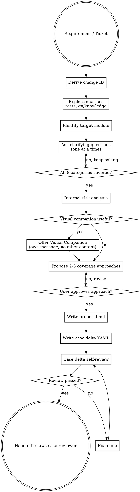

## Context Contract

Do not rely on prior conversation context.

**Before doing any work:**

1. Read `qa/changes/<change-id>/workflow-state.yaml` if it exists.
2. **Explore gate (Phase 1.1):** If `phases.explore` exists (written by `aws-explore`), apply gate logic from this repo's `aws-explore/SKILL.md` (Context Contract + Phase 1 gate):
   - `status == pending` → **STOP**
   - `status == done` → read `explore/advisory.json`; missing file → **STOP**
   - `mode == required` and `status in [failed, unavailable]` → **STOP**
   - `mode == advisory` and `status in [skipped, unavailable, failed]` → record warning, continue without advisory
3. Read **Required** inputs:
   - user requirement text
   - project source root or enough requirement context to derive QA scope
4. Read **Optional** inputs (missing = warning, do **not** STOP):
   - existing `qa/cases/**`
   - existing `tests/api/**`
   - existing `tests/e2e/**`
   - existing `qa/knowledge/**`
   - existing `qa/changes/**`
   - backend / frontend source files (when available)
   If optional QA directories are missing, record a warning and continue as a **new QA asset initialization** path. Do **not** stop solely because `qa/cases/`, `tests/`, or `qa/knowledge/` does not exist.
5. If `workflow-state.yaml` exists and `phases.skill_registry_check.status == fail` → **STOP**.
6. Use files as the sole source of truth.

**After completing work:**

1. Write all required output files:
   - `qa/changes/<change-id>/.qa.yaml`
   - `qa/changes/<change-id>/proposal.md`
   - `qa/changes/<change-id>/cases/<module>/case.yaml`
2. Create or update `qa/changes/<change-id>/workflow-state.yaml`:
   - If the file does **not** exist, create it with the full base schema (see `aws-workflow` `workflow-state.yaml` schema), including:
     - `execution_mode: inline`
     - `subagent_skill_inheritance: disabled`
     - `phases.skill_registry_check.status: skipped`
     - `phases.skill_registry_check.reason: standalone aws-case-design invocation; full registry check is owned by aws-workflow`
     - `phases.skill_registry_check.checked_skills: [aws-case-design]`
     - `agent_warnings` with `OPENCODE-SKILL-RESOLUTION-001`
   - Do **not** set `phases.skill_registry_check.status: pass` from this skill — full registry verification belongs to `aws-workflow` Phase 0.
   - Do **not** create a partial file containing only `phases.case_design`. Always write the full schema.
   - Set `phases.case_design.status = done`
   - List all output files under `phases.case_design.outputs`
3. Record any warnings or known issues explicitly in `workflow-state.yaml`.

---

# Brainstorming Requirements Into QA Coverage

Help turn requirements and change descriptions into a well-scoped QA coverage plan through collaborative dialogue — then generate the proposal and semantic case delta YAML directly in this skill.

Start by deriving the change ID and exploring the existing QA context. Ask clarifying questions **one at a time**. Once you understand the scope, propose 2–3 coverage approaches and get user approval. After approval, write `proposal.md`, then write the semantic case delta YAML and self-review it before handing off to aws-case-reviewer.

<HARD-GATE>
Do NOT generate case delta, plan, test code, execution result, review result, or archive output until:

1. QA context has been explored,
2. clarifying questions have been answered,
3. 2–3 QA coverage approaches have been proposed,
4. the user has approved the QA coverage approach.

After approval, this skill MUST:
1. Write `qa/changes/<change-id>/proposal.md`
2. Write `qa/changes/<change-id>/cases/<module>/case.yaml`

After the case YAML is written and self-reviewed, the ONLY next workflow is aws-case-reviewer.

Do NOT invoke aws-api-plan, aws-e2e-plan, aws-api-codegen, aws-e2e-codegen, or aws-archive directly from this skill.
</HARD-GATE>

## Anti-Pattern: "This Is Too Simple To Need Brainstorming"

Every QA change goes through this process. A one-line fix, a small new field, a configuration toggle — all of them. Unexamined assumptions about what to test, what data to set up, and what constitutes a pass are where most QA effort is wasted. The brainstorm can be short for simple changes, but you MUST complete it and get approval before generating any file.

## Checklist

Maintain a visible checklist for each item, or use the available task/todo tool if the environment supports it. Complete them in order:

0. **Explore gate** — read `phases.explore`; if `done`, read `explore/advisory.json` (internal; no dump to user); collect `open_questions_for_case_design[].answer` — items with `answer != null` resolve the assertion intent for **that specific `pitfall_ref` only** (do not re-ask that exact pitfall in Step 4), but do **not** mark the whole category satisfied — still cover the broader category, citing resolved pitfalls as established context; also read `test_strategy` (if present) as a **macro plan proposal** for scope/data/layer/approach — this skill still owns asking and confirming those categories, but presents `test_strategy` as a starting recommendation instead of asking from a blank slate
1. **Derive change ID** — format `<TICKET-ID>-<short-kebab-description>`
2. **Explore QA context** — check `qa/cases/`, `tests/`, `qa/knowledge/`, `qa/changes/`
3. **Identify target module** — ask one module confirmation question at a time; decompose if multiple independent modules are involved
   - If `phases.explore.status == done`: after module confirm, show **3–5 bullet Explore 摘要** (confidence tags; path to `advisory.json`; no full dump)
4. **Ask clarifying questions one at a time** — cover 8 categories; **prioritize watchlist / `exception_scenarios`** when advisory exists; lead macro categories with the `test_strategy` proposal (confirm/override) when present; treat advisory `open_questions` with `answer != null` as already-resolved for that specific pitfall (do not re-ask the same pitfall, but still cover the category); surface `answer == null` open_questions as part of their category's question
5. **Reconcile internally** — map advisory to `adopted[]`, `override[]` (with reason), `gap[]`; **do NOT dump risk report to user**; gap-only follow-up max 1–2 questions
6. **Propose 2–3 QA coverage approaches** — each must cite adopted / override / gap from Reconcile
7. **Get user approval** — wait for explicit confirmation
8. **Write `proposal.md`** — must include `## Explore Input` when advisory `done`; `_skipped` placeholder otherwise; plus `## Layer Rationale`
9. **Write case delta YAML** — to `qa/changes/<change-id>/cases/<module>/case.yaml`
10. **Self-review case delta YAML** — validate schema; **case.yaml MUST NOT contain advisory metadata** (see below)
11. **Hand off** — report completion; orchestrator invokes `aws-case-reviewer`

### case.yaml boundary (Explore)

**MUST NOT** persist in `case.yaml`:

- advisory IDs (`WL-*`, `PH-*`, `KPI-*` as trace fields)
- `evidence_ids[]`, `adopted[]`, `override[]`, `gap[]`
- `explore`, `advisory_input`, or Reconcile blocks
- `test_strategy`, `pitfall_ref`, `assertion_intent`, or any `OQ-*` id

**Only** user-approved case business fields (priority, type, assertions, automation, etc.).

Explore disposition lives **only** in `proposal.md` (`## Explore Input`).

**Readiness:** generated `case.yaml` must not contain Explore Input / evidence_ids / WL-* / PH-* metadata keys.

---

## Clarifying Question Strategy

The 8 categories below are a **coverage checklist**, not a questionnaire. Do not ask them in a batch.

**Rules:**

- Ask **one question at a time**, in the order that best reduces uncertainty.
- If a category can be inferred from project context, state the inference and ask for confirmation instead of asking an open-ended question.
- Only move to the next question when the current one is answered.
- Prefer multiple-choice questions when possible.

**open_questions deduplication (when advisory `done`):**

Before starting Step 4, partition `open_questions_for_case_design[]` from the advisory:

- `answered` = items where `answer != null` and `answered_via = "explore"` → treat as already-established context for that specific `pitfall_ref`; do not re-ask that exact pitfall. **Do NOT mark the whole category pre-satisfied** — each item only resolves the assertion intent for one pitfall, not the entire `success_assertions` / `exception_scenarios` / `out_of_scope` category. Still ask the category's broader question in Step 4, citing the already-resolved pitfalls as established context rather than re-deciding them.
- `pending` = items where `answer == null` → merge these into the category queue; ask them when their category comes up, using the original question text and options from the advisory item.

Do NOT repeat an advisory question (same `pitfall_ref`) that was already answered in `aws-explore`. The user has already answered it; use it silently as clarification context when covering the broader category.

**`test_strategy` as a macro-plan starting point (when advisory `done`):**

`aws-explore` may populate `advisory.json.test_strategy` (scope / data_focus / layer_recommendation / approach) as an evidence-derived proposal. This skill still owns the macro categories (`module_confirmation`, `change_type`, `test_types`, `data_needs`, `target_selection_depth`, `out_of_scope`) — `test_strategy` does not pre-answer them. Instead, when asking each of those categories, lead with the relevant `test_strategy` slice as a recommendation to confirm or override, rather than asking open-ended:

> "Explore 基于代码证据建议覆盖 API + E2E，并对 UserCreate/UserUpdate schema 增加 Fuzz（依据：发现用户输入 schema SC-SCHEMA-002/004）。是否采用此方案，还是需要调整？"

The user's confirm/override response is what gets recorded as `adopted[]` / `override[]` in Step 5 (Reconcile) — same mechanism as priority_hint/watchlist adoption. If `test_strategy` is absent or empty, ask the category normally with no proposal to lead with.

**The 8 categories must be covered before case delta generation — but must NOT be asked as a batch:**

| # | Category | What to Establish |
|---|---|---|
| 1 | Module confirmation | Confirmed owner module path |
| 2 | Change type | ADDED / MODIFIED / REMOVED |
| 3 | Test types | API / E2E / Fuzz / Performance |
| 4 | Data needs | Required entities and their states |
| 5 | Success assertions | Observable outcomes for each test type |
| 6 | Exception scenarios | Edge cases and error paths to include |
| 7 | Target selection + depth | Which test types (`type`) to generate? For Fuzz: which endpoints? For Performance: which capability + what P95 / error-rate thresholds? |
| 8 | Out of scope | Explicit exclusions |

> When the user selects **Fuzz**, ask which input endpoints need robustness testing. When the user selects **Performance**, ask which capability is high-frequency/core and what the acceptable P95 latency and error-rate thresholds are (no defaults — thresholds must be user-confirmed).

### Test Layer Decision Tree

For every case, apply this rule before assigning its `type`:

```
Behavior to verify:
├─ Single HTTP request + response assertion          → type: API         (tests/api/)
│    status codes / response body / permission codes / field validation / error-code matrix
├─ Multi-step browser interaction + UI feedback      → type: E2E         (tests/e2e/)
│    form submission triggers live list refresh / confirmation dialog interaction
├─ Complex input / schema / boundary / parser        → type: Fuzz        (tests/fuzz/)
│    robustness of a user-input endpoint (no crash, no 5xx, schema-valid input not wrongly rejected)
└─ High-frequency / core / heavy query / key path    → type: Performance (tests/perf/)
     absolute thresholds (P95 / error_rate), no historical baseline
```

Hard rules:
- If API can cover a functional assertion, do NOT design it as E2E.
- Error-code matrices go to API.
- E2E keeps 1 happy-path case + at most 2–3 critical exception flows.
- The same assertion point MUST NOT appear across cases of different `type`.
- **Fuzz does not replace functional assertions**: every Fuzz case MUST set `related_cases` pointing at the corresponding functional (API) case.
- **Performance MUST carry thresholds**: a Performance case without `automation.performance.scenario.thresholds` is invalid (reviewer blocker).
- **Fuzz / Performance are additive cases** — they do not cancel the API/E2E functional coverage of the same endpoint.

**Good question example:**

> "For this change, which test types should we cover?
>
> A. E2E only
> B. API only
> C. API + E2E
> D. API + E2E + exception cases
> E. Add Fuzz (input robustness) and/or Performance (high-frequency endpoints)"

**Forbidden:**

> "Please answer these 8 questions: (1) change type, (2) test types, (3) data needs..."

---

## Process Flow



**The terminal state is handoff to the orchestrator or user with:**
- `change_id`
- case file path
- next recommended skill: `aws-case-reviewer`

Do NOT invoke `aws-case-reviewer` directly when running under `aws-workflow`. Do NOT invoke aws-api-plan, aws-e2e-plan, aws-api-codegen, aws-e2e-codegen, or aws-archive from aws-case-design.

---

## The Process

### Step 1: Derive Change ID

Every brainstorm must be tied to a change ID. This ID is the directory name under `qa/changes/`.

**Format:**

```
<TICKET-ID>-<short-kebab-description>
```

**Examples:**

| Input | Change ID |
|---|---|
| "REQ-001 add order receive" | `REQ-001-order-receive` |
| "BUG-234 fix empty state on warehouse list" | `BUG-234-empty-state` |
| "TASK-89 support bulk import for items" | `TASK-89-bulk-import` |

**If no ticket ID is provided**, ask the user once:

> "What ticket or requirement ID should I use for this change? (e.g. REQ-001, BUG-234, TASK-89) Or I can generate a date-based ID like `QA-20260601-order-receive`."

Do not proceed until you have an ID.

---

### Step 2: Explore QA Context

Before asking any questions, explore the existing QA state. This prevents proposing cases that already exist and ensures you understand current module ownership and automation coverage.

**Check in this order** (all paths are optional on first-time QA setup — record a warning and continue if missing):

```
qa/cases/                         → module structure and ownership
qa/cases/<likely-module>/case.yaml → existing case IDs, style, naming conventions
tests/api/                        → current API automation coverage
tests/e2e/                        → current E2E automation coverage
qa/knowledge/                     → data factory patterns, natural step conventions
qa/changes/                       → in-progress or recently archived changes (overlap check)
```

**What to derive:**

- Existing module ownership — where does this requirement likely live?
- Existing case IDs — what is the highest existing ID to avoid collision?
- Possible duplicate cases — are there overlapping cases already in `qa/cases/`?
- Current API / E2E automation coverage — what is already automated?
- Domain-specific data factories or natural step templates in `qa/knowledge/`
- Related in-progress changes — any conflicts or dependencies?

**If the requirement spans multiple independent modules:**

> "This requirement seems to span `<module-A>` and `<module-B>`. These are independent modules. I recommend scoping this brainstorm to one module at a time. Which should we start with?"

---

## Knowledge Source Boundary

| Source | Purpose | aws-case-design may |
|---|---|---|
| `qa/knowledge/` | Project documentation: business terms, page flows, natural step conventions, historical QA notes | Read only |
| `.aws/data-knowledge.yaml` | Formal data capability registry used by planning/codegen gates | Read only; must NOT create or modify |

If missing data capabilities are discovered during brainstorming, record them in:

- `proposal.md` under **Data Needs**
- case YAML `test_data` as natural language needs

Formal promotion into `.aws/data-knowledge.yaml` is handled outside `aws-case-design` (by the user or a dedicated data knowledge update process).

---

### Step 3: Identify Target Module

Ask **one module confirmation question at a time**.

If the requirement appears to span multiple independent modules, ask the user to choose the **first module to scope**. Do not force all modules into one case delta.

Example:

> "This looks like it belongs under `qa/cases/warehouse/inbound/`. Is that correct, or should another module own these cases?"

Wait for confirmation before continuing.

---

### Step 4: Ask Clarifying Questions One at a Time

Follow the strategy in **Clarifying Question Strategy** above.

Cover all 8 categories before proposing coverage approaches. One question per message.

---

### Step 5: Internal Risk Analysis

After clarifying questions, analyze risks internally. Do NOT dump this full analysis to the user. Use it to inform the coverage approaches you propose.

**Consider:**

- Business state transitions and side effects
- Required data state (entities that must exist, statuses, ownership)
- Auth and permission boundaries
- Repeated actions and idempotency
- Invalid input and boundary conditions
- External dependencies (third-party services, async jobs)
- Async UI behavior (loading states, polling, delayed updates)
- API / UI consistency (are the same business rules enforced at both layers?)
- Regression risk (what existing behavior could this break?)
- Flaky automation risk (timing issues, dynamic data, environment-sensitive steps)

---

### Step 6: Optional Visual Companion

Consider offering the visual companion **only** when the upcoming question involves genuinely visual content.

**Use the browser for:**

- UI flow comparison (multiple E2E paths side by side)
- E2E path diagram (step-by-step user flow visualization)
- Test coverage matrix (module × test type grid)
- Data flow diagram (how data moves between API, DB, and UI)
- Page interaction mockup (which elements are under test)

**Use the terminal for:**

- Module confirmation
- Change type confirmation (ADDED / MODIFIED / REMOVED)
- Data needs clarification
- Success assertion text
- Exception scope decisions
- Automation target yes/no

**Offering the companion** (this offer MUST be its own message):

> "Some of what we're working on might be easier to explain if I can show it in a browser — for example, an E2E path diagram or a coverage matrix. Want to try it? (Requires opening a local URL)"

If they agree, read: `skills/aws-case-design/visual-companion.md`

**Visual companion is optional and must never block case design.** If the browser, local URL, or companion tooling is unavailable, continue with text-only coverage approaches. Do not wait for visual setup before writing `proposal.md` or case YAML.

---

### Step 7: Propose 2–3 QA Coverage Approaches

Present 2–3 options with trade-offs and your recommendation. Lead with your recommendation. Wait for explicit approval before writing any file.

**Example:**

> **A. E2E only**
> - Covers the user workflow end-to-end.
> - Fast to create and easy to maintain.
> - Does not verify backend state or business rules independently.
>
> **B. API + E2E** ← Recommended
> - API verifies backend state transitions and business rules.
> - E2E verifies the user-visible path and UI consistency.
> - Recommended for state-changing workflows where both layers matter.
>
> **C. API + E2E + exception cases**
> - Best regression coverage for high-risk features.
> - Requires more data setup and more cases.
> - Appropriate when this feature is critical path or has a history of regressions.
>
> Recommendation: **B**, because this is a state-changing workflow.

---

### Step 8: Write proposal.md

After the user approves the coverage approach, write:

```
qa/changes/<change-id>/proposal.md
```

`proposal.md` records the approved QA proposal. It is a **process asset**, not a main asset. It must not be merged into `qa/cases/`. It will be archived with the change.

**Required format:**

```markdown
# Proposal: <change-id>

## Why

Why this QA change is needed.

## Test Basis

- Requirement ID: <requirement-id>
- Feature Name: <feature-name>
- Source: GitLab issue / product requirement / OpenSpec requirement / user story
- Target Module: <module>
- Target Case File: `qa/cases/<module>/case.yaml`

## What to Test

What behavior, module, business flow, or interface capability this change covers.

## Out of Scope

What is explicitly excluded from this change.

## Confirmed Coverage Approach

The selected coverage approach and rationale.

Example:
> 选择 API-only 覆盖，因为当前需求只验证 logout 接口最小响应级行为，不扩展 token 吊销、多设备登出和审计链路。

## Test Conditions

| Condition ID | Condition | Source | Priority | Risk Level | Design Technique |
|---|---|---|---|---|---|
| COND-<MODULE>-001 | <test condition description> | <requirement-id> | P0 | high | use_case |
| COND-<MODULE>-002 | <test condition description> | <requirement-id> | P1 | medium | negative |

## Quality Risks

| Risk | Likelihood | Impact | Level | Mitigation |
|---|---|---|---|---|
| <risk description> | 1–5 | 1–5 | low/medium/high/critical | <mitigation> |

## Test Types

- API
- E2E

## Layer Rationale

For each case in this change, record the layer assignment and rationale.
Format is fixed — reviewer uses `case_id` to cross-check each case's `type`.

- TC_MENU_001: API
  - reason: <why API is sufficient, e.g. validates status code / response body directly>

- TC_MENU_E2E_001: E2E
  - reason: <why E2E is required, e.g. validates browser interaction and live UI update>

- TC_MENU_FUZZ_001: Fuzz
  - reason: <endpoint accepts user-input schema, needs robustness; relates TC_MENU_001>

- TC_MENU_PERF_001: Performance
  - reason: <high-frequency query endpoint, P95 < 200ms; relates TC_MENU_002>

## Explore Input

<!-- Include this section ONLY when phases.explore.status == done. Otherwise write: _skipped (no advisory)_ -->

- advisory: `explore/advisory.json` (status: done | degraded)
- source_code_read: true | false
- test_strategy: adopted as-is | adopted with overrides | not provided
  - proposal: <test_strategy.approach, if present>
  - override: [<layer/scope item>: reason — <rationale for overriding this part of the proposal>]
- open_questions (assertion-intent, per pitfall):
  - answered in explore: OQ-001 (pitfall_ref: SC-RBAC-001, success_assertions) — assert_known_bug, "<answer>"
  - pending (answered here): OQ-002 (pitfall_ref: SC-SCHEMA-005, exception_scenarios) — assert_ideal, "<answer given in this session>"
  - skipped: OQ-004 (pitfall_ref: SC-SCHEMA-004, out_of_scope) — left unanswered
- adopted: [PH-001 → TC_MODULE_001, WL-002 → TC_MODULE_003]
- override: [PH-002: reason — <rationale for overriding this priority hint>]
- gap: [macro categories clarified here beyond what test_strategy covered]

## Data Needs

Required data factories, inputs, and outputs.

## Success Assertions

Natural language expected outcomes.

## Exception Scenarios

Approved exception cases, or explicitly excluded ones.

## Entry Criteria

- Requirements are clear enough to derive test conditions.
- Target module is confirmed.
- Target case file path is confirmed.
- Required fixtures / factories can be created or reused.

## Exit Criteria for This Phase

- `proposal.md` is written.
- `cases/<module>/case.yaml` is generated and self-reviewed.
- Each case is traceable to `requirement_id` and `test_condition_id`.
- Test targets (`type`) are identified and confirmed by the user (`automation.confirmed_by`).
- Ready for `aws-case-reviewer`.

## Downstream Exit Criteria

- After case review passes, `plans/*.md` can be generated by downstream plan skills (`aws-api-plan`, `aws-e2e-plan`).
- After codegen and execution, traceability can be updated by downstream execution/archive phases (`aws-run`, `aws-archive`).
```

`proposal.md` is a **process asset**. It must NOT be merged into `qa/cases/`. It will be archived with the change. It prevents aws-api-plan, aws-e2e-plan, and aws-api-codegen/aws-e2e-codegen from drifting from the approved scope.

---

### Step 9: Write Case Delta YAML

After writing `proposal.md`, generate and write the semantic case delta YAML.

**Output path:**

```
qa/changes/<change-id>/cases/<module>/case.yaml
```

**Target stable case file (for archive merge):**

```
qa/cases/<module>/case.yaml
```

This YAML is the **source of truth** for this change. It is a delta file even though it is named `case.yaml`.

- Do NOT generate Markdown case files as the source of truth.
- The case YAML describes **what to test**, not how to implement the test code.

Follow the **Case YAML Output Contract** section exactly. Apply **Delta Operation Rules** to decide `added` / `modified` / `removed`.

---

### Step 10: Case Delta Self-Review

After writing the YAML, self-review it using the **Case Delta Readiness Check** below.

If issues are found: fix them inline and re-check. Do not ask the user for review until the YAML passes all checks.

Once the YAML passes, show the user a brief summary:

```
Files written:
  qa/changes/<change-id>/proposal.md
  qa/changes/<change-id>/cases/<module>/case.yaml

Case delta:
  ADDED: N cases
  MODIFIED: M cases
  REMOVED: K cases

Coverage approach: <A/B/C> — <rationale>
```

Then report:

> "Case design is complete. Next recommended step: `aws-case-reviewer`."

---

### Step 11: Hand off to orchestrator

After the case YAML is written and self-reviewed, **do not invoke `aws-case-reviewer` directly**. Instead, report completion to the caller (orchestrator or user) and indicate that `aws-case-reviewer` should be run next.

If operating standalone (no orchestrator), the user may explicitly ask to invoke `aws-case-reviewer`. In orchestrated runs, the orchestrator manages the review lifecycle and will invoke the reviewer as Phase 2.

Pass the change ID and case YAML path:

```
change-id: <change-id>
case file: qa/changes/<change-id>/cases/<module>/case.yaml
```

Do NOT generate plans in this skill. Planning is done by aws-api-plan and aws-e2e-plan after case review passes.

---

## QA Change Directory Protocol

The full directory structure for a QA change:

```
qa/
├── cases/
│   └── <module>/
│       └── case.yaml               ← stable main asset (merged after archive)
│
├── changes/
│   └── <change-id>/
│       ├── .qa.yaml                ← change metadata and workflow state
│       ├── proposal.md             ← why / what / coverage approach (process asset)
│       ├── cases/
│       │   └── <module>/
│       │       └── case.yaml       ← case delta (this change's added/modified/removed)
│       ├── plans/                  ← created by aws-api-plan / aws-e2e-plan, NOT by aws-case-design
│       │   ├── api-plan.md         ← API test implementation plan (Markdown)
│       │   └── e2e-plan.md         ← E2E test implementation plan (Markdown)
│       ├── execution/
│       │   ├── api-result.json
│       │   ├── e2e-result.json
│       │   ├── summary.md
│       │   └── execution-manifest.yaml
│       ├── review/
│       │   ├── case-review.json
│       │   ├── case-review-summary.md
│       │   ├── api-plan-review.json
│       │   ├── api-plan-review-summary.md
│       │   ├── plan-review.json
│       │   └── plan-review-summary.md
│       └── trace/
│           └── traceability-matrix.yaml
│
└── archive/
```

**Mapping to OpenSpec concepts:**

| Superpowers for QA | OpenSpec |
|---|---|
| `qa/changes/<id>/.qa.yaml` | `openspec/changes/<id>/.openspec.yaml` |
| `qa/changes/<id>/proposal.md` | `openspec/changes/<id>/proposal.md` |
| `qa/changes/<id>/plans/*.md` | `openspec/changes/<id>/tasks.md` |
| `qa/changes/<id>/cases/<module>/case.yaml` | `openspec/changes/<id>/specs/<module>/spec.md` |
| `qa/cases/<module>/case.yaml` | `openspec/specs/<module>/spec.md` |
| `added / modified / removed` | `ADDED / MODIFIED / REMOVED Requirements` |
| `aws-archive` | `openspec archive` |

**Asset types:**

| Asset | Type | Merged on archive? |
|---|---|---|
| `qa/cases/<module>/case.yaml` | Main asset | — (target of merge) |
| `qa/changes/<id>/cases/<module>/case.yaml` | Delta (process) | Yes → merged into main |
| `qa/changes/<id>/proposal.md` | Process asset | No → archived only |
| `qa/changes/<id>/plans/*.md` | Process asset | No → archived only |
| `qa/changes/<id>/execution/` | Process asset | No → archived only |
| `qa/changes/<id>/review/` | Process asset | No → archived only |
| `qa/changes/<id>/trace/` | Process asset | No → archived only |

---

## .qa.yaml Template

`.qa.yaml` stores **stable change metadata** (change id, targets, feature name). `workflow-state.yaml` stores **mutable runtime phase state** and is the gate source for orchestration.

The optional `workflow` section below is **informational only** — do **not** use `.qa.yaml.workflow` as a gate source.

```yaml
schema_version: "1.0"
schema: case-driven
created_at: "YYYY-MM-DDTHH:mm:ssZ"

change:
  change_id: REQ-001-order-receive
  requirement_id: REQ-001
  feature_name: order-receive
  status: draft

targets:
  cases:
    - module: warehouse.inbound
      change_case_file: qa/changes/REQ-001-order-receive/cases/warehouse/inbound/case.yaml
      target_case_file: qa/cases/warehouse/inbound/case.yaml

workflow:   # informational only — not a gate source
  current_step: aws-case-design
  next_step: aws-case-reviewer
```

---

## Case YAML Output Contract

The generated case delta MUST be YAML. It contains natural language QA cases.

`change` metadata lives in `.qa.yaml`. `proposal` (coverage approach) lives in `proposal.md`. The case file itself contains only cases.

**Required path:**

```
qa/changes/<change-id>/cases/<module>/case.yaml
```

**Target stable case file:**

```
qa/cases/<module>/case.yaml
```

**Top-level structure (case.yaml contains ONLY these keys):**

```yaml
schema_version: "1.0"

added: []
modified: []
removed: []
```

**Every case under `added` or `modified` MUST include all of these fields:**

```yaml
case_id: <stable-case-id>            # underscore-only, e.g. TC_USER_AUTH_001, TC_MENU_FUZZ_001, TC_MENU_PERF_001 (hyphens NOT allowed)
title: <human-readable-title>
status: draft | active | deprecated
priority: P0 | P1 | P2 | P3
severity: blocker | critical | major | minor
type: API | E2E | Fuzz | Performance    # single source of truth for the test target (one case, one target)
module: <module-id>
requirement_id: <requirement-id>
feature_name: <feature-name>
test_condition_id: <condition-id>    # from proposal.md Test Conditions table
design_technique: use_case | equivalence_partitioning | boundary_value_analysis | decision_table | state_transition | exploratory | negative | checklist
tags: []

objective: <为什么需要这个 case，测试目标>
summary: >
  <用一句话说明这个 case 测什么，用于 Web 展示>

risk:
  likelihood: 1 | 2 | 3 | 4 | 5     # 1=rare, 5=almost certain
  impact: 1 | 2 | 3 | 4 | 5         # 1=negligible, 5=catastrophic
  level: low | medium | high | critical
  rationale: <为什么这样评估风险>

preconditions:
  - <自然语言前置条件>

test_data:
  - <自然语言测试数据准备说明，或 fixture 名称>

steps:
  - <自然语言步骤，不写 locator，不写代码>

assertions:
  - <自然语言断言，可包含 HTTP 状态码等可观察结果>

postconditions:
  - <执行后状态、清理要求、不需要验证的后置状态>

edge_cases:
  - <相关边界或变体场景，不一定在本 case 覆盖>

related_cases:
  - <关联 case_id，用于 Web 页面联动展示>

automation:
  required: true | false
  # NOTE: there is NO `target` field. The top-level `type` is the single source of
  # truth for the test target (one case, one target). `automation` only says HOW.
  framework: pytest | pytest-playwright | schemathesis | locust | null
  suggested_file: <optional-test-file-path>
  status: not_automated | planned | automated | flaky | deprecated

  # Selection lock: written when the user confirms the target selection. Downstream
  # Plan/Codegen/Run skills read these as read-only and MUST NOT override the choice.
  confirmed_by: user | null
  confirmed_at: <ISO-8601 | null>

  # Target-specific config — present ONLY when `type` matches.
  fuzz:                          # only when type: Fuzz
    endpoints: ["/api/v1/menu/create"]
    expectations: ["no 5xx", "schema-valid input not rejected with 400"]
  performance:                   # only when type: Performance
    scenario:
      capability: "menu-list-query"
      endpoint: "/api/v1/menu/list"
      thresholds: { p95_ms: 200, error_rate_max: 0.01 }   # absolute, user-confirmed (no defaults)
      load: { users: 50, spawn_rate: 10, run_time_s: 60 }

regression:
  candidate: true | false
  tier: smoke | sanity | regression | full | none
  selection_reason: []              # e.g. [critical_user_journey, security_related]
  maintenance_rule: <when to keep/update/remove this case>
  rationale: <为什么归入这个 tier>

trace:
  supersedes: []              # optional — prior requirement/case ids this case replaces
  related_requirements: []    # optional — related requirement ids
  change_reason: ""           # optional — why this case changed; may be filled during design
```

`trace` is required on every case but **may be `{}` or partially empty during case design**. Downstream archive / execution may enrich it. Reviewers should treat empty `trace` as compliant at case-design time.

**`type` → `framework` → output directory (must match):**

| `type` | `automation.framework` | output dir |
|--------|------------------------|------------|
| API | pytest | `tests/api/` |
| E2E | pytest-playwright | `tests/e2e/` |
| Fuzz | schemathesis | `tests/fuzz/` |
| Performance | locust | `tests/perf/` |

One case has exactly one `type`. Fuzz and Performance are **independent cases** (`type: Fuzz` / `type: Performance`) that link the functional case they harden via `related_cases`. They do **not** replace the functional API/E2E coverage of that endpoint.

**Example case (natural language + ISTQB fields):**

```yaml
modified:
  - case_id: TC_USER_AUTH_002
    title: 有效登录用户可以成功登出
    status: draft
    priority: P0
    severity: blocker
    type: API
    module: user.auth
    requirement_id: REQ-002
    feature_name: user-logout
    test_condition_id: COND-USER-AUTH-001
    design_technique: use_case
    tags:
      - logout
      - happy-path

    objective: 验证已登录用户调用登出接口时，系统返回登出成功。
    summary: >
      已登录用户携带有效 access_token 调用登出接口时，系统应返回登出成功。

    risk:
      likelihood: 3
      impact: 5
      level: high
      rationale: 登出是认证模块核心链路，失败会影响认证安全和用户会话控制。

    preconditions:
      - 系统中存在一个已激活用户
      - 用户已经登录并获得有效 access_token

    test_data:
      - 使用 active_user_fixture 创建或获取已激活用户
      - 登录后获得 access_token

    steps:
      - 创建或获取已激活用户
      - 使用该用户完成登录
      - 携带有效 access_token 调用登出接口
      - 查看接口响应结果

    assertions:
      - 接口返回 HTTP 200
      - 响应业务码为 200
      - 响应消息为"登出成功"

    postconditions:
      - 本 case 不验证 token 吊销状态
      - 测试完成后清理或复用测试用户

    edge_cases:
      - 未携带 Token 调用登出接口
      - 携带无效 Token 调用登出接口

    related_cases:
      - TC_USER_AUTH_003
      - TC_USER_AUTH_004

    automation:
      required: true
      framework: pytest
      suggested_file: tests/api/test_auth_api.py
      status: planned
      confirmed_by: user
      confirmed_at: "2026-06-15T08:00:00Z"

    regression:
      candidate: true
      tier: smoke
      selection_reason:
        - critical_user_journey
        - security_related
      maintenance_rule: keep_until_feature_deprecated
      rationale: 登出是认证模块核心链路，P0 且安全相关。

    trace:
      supersedes: REQ-001-auth-login-logout
      change_reason: 聚焦登出最小响应级断言，对齐当前 API 实现
```

**Every case under `removed` MUST include:**

```yaml
case_id: <existing-case-id>
reason: <why this case is no longer needed>
```

---

## Delta Operation Rules

When generating `qa/changes/<change-id>/cases/<module>/case.yaml`, decide the operation at generation time.

- Use `added` when the case does not exist in the target case file (`qa/cases/<module>/case.yaml`).
- Use `modified` when the case already exists and this change updates its content.
- Use `removed` when the case already exists but is no longer applicable.

**Do not leave this decision to archive.**

**Before writing the delta:**

1. Read `qa/cases/<module>/case.yaml` if it exists.
2. Compare by `case_id`.
3. Put each case into exactly one of `added`, `modified`, or `removed`.

**Validation rules:**

- `added.case_id` MUST NOT already exist in the target case file.
- `modified.case_id` MUST already exist in the target case file.
- `removed.case_id` MUST already exist in the target case file.

If the target case file does not exist yet, all cases must be `added`.

---

## Natural Language Case Rules

The case YAML contains **user-readable QA cases** optimized for Web display and human review. All fields must be written in natural language.

Case YAML describes what to test. API mapping belongs to `api-plan.md`. E2E locator mapping belongs to `e2e-plan.md` and `tests/e2e/`.

**Allowed:**

```yaml
objective: 验证已登录用户调用登出接口时，系统返回登出成功。

summary: >
  已登录用户携带有效 access_token 调用登出接口时，系统应返回登出成功。

preconditions:
  - 系统中存在一个已激活用户

test_data:
  - 使用 active_user_fixture 创建或获取已激活用户

steps:
  - 携带有效 access_token 调用登出接口
  - 查看接口响应结果

assertions:
  - 接口返回 HTTP 200
  - 响应业务码为 200

postconditions:
  - 本 case 不验证 token 吊销状态

edge_cases:
  - 未携带 Token 调用登出接口

related_cases:
  - TC_USER_AUTH_003

automation:
  required: true
  target: API
  framework: pytest
  suggested_file: tests/api/test_auth_api.py
  status: planned

regression:
  candidate: true
  tier: smoke
  rationale: P0 核心认证链路。
```

**Forbidden in case YAML — these belong in `plans/api-plan.md` or `tests/`:**

- `method`, `path`, `headers` mappings (`POST /api/v1/base/logout`)
- `Authorization` header values (`Bearer ${token}`, `Bearer invalid.token.string`)
- Concrete request URLs with environment host (`https://prod.example.com/api/...`)
- Hard-coded auth tokens, real credentials, or secrets
- `pytest` test code or fixtures (`def test_`, `assert`, `@pytest.fixture`)
- `httpx` / `requests` call code
- Playwright test code (`page.locator(...)`, `await page.click(...)`)
- CSS selectors (`.btn-receive`, `#order-form`)
- XPath (`//button[@class='receive']`)
- `data-testid` attributes
- Raw SQL data setup
- Execution history or test run results
- Attachments, screenshots, or videos

**Where execution details belong:**

```
plans/api-plan.md    → method / path / auth / API mapping / pytest commands
plans/e2e-plan.md    → natural steps / environment / Playwright commands
tests/api/           → actual pytest implementation
tests/e2e/           → actual Playwright implementation
execution/*.yaml     → test run results
```

---

## Case Priority and Severity Rules

Every generated case MUST include both `priority` and `severity`.

**Priority** — execution and release priority:

| Level | Meaning |
|---|---|
| P0 | Smoke / critical path — must always pass before release |
| P1 | Core business logic — high confidence required |
| P2 | Important but not blocking release |
| P3 | Edge case / low risk |

**Severity** — business impact if this behavior fails:

| Level | Meaning |
|---|---|
| `blocker` | Completely prevents core user flow |
| `critical` | Major feature broken, no workaround |
| `major` | Feature degraded, workaround exists |
| `minor` | Minor UX or edge case issue |

**Default mapping:**

| Priority | Severity | Typical use |
|---|---|---|
| P0 | blocker / critical | Release-blocking core flow |
| P1 | critical / major | Important regression or high-value feature |
| P2 | major / minor | Normal coverage |
| P3 | minor | Optional or low-risk edge case |

If uncertain, choose the lower priority and explain the assumption in `proposal.md` or in the case notes.

---

## Risk-based Regression Rules

Every case under `added` or `modified` MUST include a `regression` block.

```yaml
regression:
  candidate: true | false
  tier: smoke | sanity | regression | full | none
  selection_reason:
    - critical_user_journey
    - security_related
  maintenance_rule: keep_until_feature_deprecated
  rationale: <为什么归入这个 tier>
```

**Tier definitions:**

| Tier | When to use |
|---|---|
| `smoke` | Release-blocking core happy paths (P0). Must pass before any deployment. |
| `sanity` | Focused validation after small changes. Key scenarios only. |
| `regression` | Normal recurring coverage. Standard regression suite. |
| `full` | Broad end-to-end coverage. Run periodically or before major releases. |
| `none` | One-off, low-value, or deprecated case. Not included in any suite. |

**`selection_reason` values** (use one or more):

| Value | Meaning |
|---|---|
| `critical_user_journey` | Core user workflow |
| `security_related` | Auth, permissions, sensitive data |
| `high_risk` | Risk level is high or critical |
| `regression_prone` | History of regressions in this area |
| `newly_added_feature` | New behavior not yet stable |
| `contract_boundary` | API contract or integration boundary |

**`maintenance_rule` values:**

| Value | When to use |
|---|---|
| `keep_until_feature_deprecated` | Keep as long as the feature is active |
| `keep_for_one_release` | Remove after one stable release cycle |
| `review_after_refactor` | Re-evaluate when implementation changes |
| `remove_if_automated` | Remove manual case once automated |

**Rules:**

- P0 cases SHOULD be `smoke` or `sanity`.
- P1 cases SHOULD be `regression` or `smoke`.
- P2/P3 cases MAY be `regression`, `full`, or `none`.
- `rationale` must explain the tier selection. Do not leave it blank.
- `candidate: false` means the case is intentionally excluded from regression suites. Always provide a `rationale`.
- `selection_reason` supports risk-based suite selection for Web dashboards and CI pipelines.

**Security rule:** Never include real credentials, real tokens, hardcoded secrets, or environment-specific credentials in any case field. Test data references must use fixture names or generic descriptions.

---

## Test Conditions Rule

Before generating the case delta YAML, derive test conditions from the test basis (requirements, user stories, feature descriptions).

**Test conditions establish the mapping:**

```text
requirement_id → test_condition_id → case_id → plan → test code → execution result
```

**What is a test condition?**

A test condition is a testable statement derived from a requirement. It is higher-level than a test case and links requirements to cases.

Example:

| Condition ID | Condition | Source | Priority | Risk Level | Design Technique |
|---|---|---|---|---|---|
| COND-USER-AUTH-001 | 验证有效登录用户可以成功登出 | REQ-002 | P0 | high | use_case |
| COND-USER-AUTH-002 | 验证未认证登出请求会被拒绝 | REQ-002 | P1 | medium | negative |

**Rules:**

- Derive test conditions internally during brainstorming (Step 5: Internal Risk Analysis).
- Write the final test conditions table in `proposal.md`.
- Every generated case MUST reference `test_condition_id`.
- If `test_condition_id` cannot be derived, use `TBD` and explain why in `proposal.md`.
- One test condition can map to multiple cases (e.g. happy path + negative cases).

---

## Test Design Technique Rule

Every generated case MUST include a `design_technique` field.

```yaml
design_technique: use_case | equivalence_partitioning | boundary_value_analysis | decision_table | state_transition | exploratory | negative | checklist
```

**Technique selection guide:**

| Technique | Use when |
|---|---|
| `use_case` | Testing a user workflow or business flow end-to-end |
| `equivalence_partitioning` | Testing valid vs. invalid input classes |
| `boundary_value_analysis` | Testing numeric limits, min/max values, or range edges |
| `decision_table` | Testing combinations of business rules (if A and B, then C) |
| `state_transition` | Testing lifecycle or status changes (draft → active → closed) |
| `exploratory` | Intentionally open-ended investigation without predefined steps |
| `negative` | Testing auth errors, validation rejections, and invalid states |
| `checklist` | Light-weight coverage of a known list of conditions |

**Rules:**

- Choose ONE primary technique per case.
- The technique should justify the design of `steps` and `assertions`.
- `negative` cases should reference the corresponding happy-path case in `related_cases`.
- `exploratory` cases SHOULD have time-boxed `steps` and a focused `objective`.

---

## Risk-based Testing Rule

Every generated case MUST include a `risk` block.

```yaml
risk:
  likelihood: 1 | 2 | 3 | 4 | 5   # 1=rare, 5=almost certain
  impact: 1 | 2 | 3 | 4 | 5       # 1=negligible, 5=catastrophic
  level: low | medium | high | critical
  rationale: <why this risk score>
```

**Risk level mapping:**

| likelihood × impact | level |
|---|---|
| ≥ 15 | `critical` |
| 8 – 14 | `high` |
| 4 – 7 | `medium` |
| 1 – 3 | `low` |

**Use risk to justify:**

- `priority` — high-risk cases should be P0 or P1
- `severity` — critical/high impact maps to `blocker` or `critical`
- `automation.required` — true for high/critical risk cases
- `regression.tier` — high-risk cases should be in `smoke` or `regression`

**Rules:**

- Risk assessment is done internally. Do NOT ask the user to score risks.
- If uncertain, default to `likelihood: 3, impact: 3, level: medium`.
- `rationale` must explain the scoring. One sentence is sufficient.
- Cross-check: if `priority: P0` but `risk.level: low`, document the mismatch in `proposal.md`.

---

## Downstream Plans

`aws-case-design` does **NOT** generate plans.

After case review passes:

- `aws-api-plan` generates `qa/changes/<change-id>/plans/api-plan.md` (+ related M3 plan files)
- `aws-e2e-plan` generates `qa/changes/<change-id>/plans/e2e-plan.md` (+ related M4 plan files)

**Ownership boundaries:**

| Concern | Owner skill / artifact |
|---|---|
| API method / path / auth mapping | `aws-api-plan` → `plans/api-plan.md` |
| E2E route / selector / data setup mapping | `aws-e2e-plan` → `plans/e2e-plan.md` |
| Test code | `aws-api-codegen` / `aws-e2e-codegen` |
| Execution results | `aws-run` → `execution/*` |

Do **not** embed pytest execution, Playwright execution, or `execution/*-result.json` expectations in case YAML or in this skill. Plans describe implementation intent; they do **not** execute tests or write execution results.

---

## Case Delta Readiness Check

Before invoking aws-case-reviewer, verify that ALL of these are true. Fix any issue inline before proceeding.

**YAML structure:**

1. YAML is valid and parseable.
2. `schema_version` exists.
3. `added`, `modified`, and `removed` are arrays (not null).
4. case.yaml does NOT contain a top-level `change:` block (belongs in `.qa.yaml`).
5. case.yaml does NOT contain a top-level `proposal:` block (belongs in `proposal.md`).

**Delta operation correctness:**

6. `added.case_id` — does NOT exist in target case file.
7. `modified.case_id` — DOES exist in target case file.
8. `removed.case_id` — DOES exist in target case file.

**Per-case fields (every added / modified case):**

9. `case_id` — exists and matches `TC_[A-Z0-9]+(_[A-Z0-9]+)*_[0-9]{3}` format (underscore-only; hyphens NOT allowed; e.g. `TC_USER_001`, `TC_API_V2_001`, `TC_M4_E2E_001`, `TC_3D_ASSET_001`).
10. `case_id` — unique within this delta.
11. `title` — exists and is not empty.
12. `status` — one of draft, active, deprecated.
13. `priority` — one of P0, P1, P2, P3.
14. `severity` — one of blocker, critical, major, minor.
15. `type` — exists and is one of `API`, `E2E`, `Fuzz`, `Performance`.
16. `module` — exists.
17. `requirement_id` — exists.
18. `feature_name` — exists.
19. `test_condition_id` — exists (TBD is acceptable if documented in proposal.md).
20. `design_technique` — exists and is a valid enum value.
21. `objective` — exists and is not empty.
22. `summary` — exists and is not empty.
23. `risk.likelihood`, `risk.impact`, `risk.level` — all present.
24. `risk.rationale` — present and non-empty.
25. `preconditions` — exists (may be empty list).
26. `test_data` — exists (may be empty list).
27. `steps` — not empty.
28. `assertions` — not empty.
29. `postconditions` — exists (may be empty list, but must be present).
30. `edge_cases` — exists (may be empty list, but must be present).
31. `related_cases` — exists (may be empty list, but must be present).
32. `automation` — has `required`, `framework`, `status` (there is **no** `automation.target` — `type` is the single source of truth).
    - `automation.framework` — one of `pytest`, `pytest-playwright`, `schemathesis`, `locust`, `null`, and MUST match `type`: API→pytest, E2E→pytest-playwright, Fuzz→schemathesis, Performance→locust.
    - `automation.status` — one of `not_automated`, `planned`, `automated`, `flaky`, `deprecated`.
    - When `type == Fuzz`: `automation.fuzz.endpoints` is present and non-empty, and `related_cases` points at ≥1 non-Fuzz case.
    - When `type == Performance`: `automation.performance.scenario.thresholds` has non-empty `p95_ms` and `error_rate_max` (no placeholders).
33. `regression` — has `candidate`, `tier`, `rationale`.
34. `regression.selection_reason` — present (may be empty list).
35. `regression.maintenance_rule` — present and non-empty.
36. `trace` — exists (may be `{}` or partially filled; see **trace** schema in Case YAML Output Contract).

**Natural language rules:**

37. `steps` contains no CSS selectors, XPath, `page.locator()`, or `data-testid`.
38. `steps` contains no `method/path/headers/Authorization` mappings.
39. `steps` contains no pytest/httpx/requests/Playwright code.
40. `assertions` contains no raw auth tokens or environment-specific URLs.
41. No execution history is embedded in any case field.
42. No attachments, screenshots, or video references in any case field.
43. No real credentials, real tokens, or hardcoded secrets in any field.
44. No `semantic_steps`, `e2e_natural_steps`, `api_intent`, or `automation_targets` fields appear.

**ISTQB traceability rules:**

45. `priority` is consistent with `risk.level` (P0/P1 should have high/critical risk, or mismatch is documented in proposal.md).
46. `automation.required: true` for all cases with `risk.level: high` or `risk.level: critical`.
47. `regression.tier` is consistent with `priority` (P0 → smoke/sanity, P1 → regression/smoke).

**Coverage:**

48. At least one happy path case (P0 or P1) exists in `added` or `modified`.
49. `proposal.md` exists at `qa/changes/<change-id>/proposal.md`.
50. `.qa.yaml` exists at `qa/changes/<change-id>/.qa.yaml`.

---

## Next Workflow

After writing and self-reviewing the case YAML:

- **If running under `aws-workflow` (orchestrated):** do **NOT** invoke `aws-case-reviewer` directly. Report completion to the orchestrator. The orchestrator will invoke `aws-case-reviewer` as Phase 2.
- **If running standalone and the user explicitly asks to continue:** load `aws-case-reviewer` next.

`aws-case-reviewer` reads:

```
qa/changes/<change-id>/proposal.md
qa/changes/<change-id>/cases/<module>/case.yaml
```

After case review passes, the orchestrator routes to:
- `aws-api-plan` (if test_types includes api)
- `aws-e2e-plan` (if test_types includes e2e)

Do NOT generate plans in this skill.

---

## Traceability Matrix Template

The traceability matrix is initialized or updated by downstream execution and archive phases (`aws-run` / `aws-archive`), not by `aws-case-design`. It lives at:

```
qa/changes/<change-id>/trace/traceability-matrix.yaml
```

It implements the full ISTQB traceability chain:

```text
requirement_id → test_condition_id → case_id → plan → test code → execution result
```

**Template:**

```yaml
schema_version: "1.0"

change_id: <change-id>

links:
  - requirement_id: REQ-002
    test_condition_id: COND-USER-AUTH-001
    case_id: TC_USER_AUTH_002
    plan:
      api: qa/changes/<change-id>/plans/api-plan.md
      e2e: null
    test_code:
      api: tests/api/test_auth_api.py
      e2e: null
    execution_result:
      api: qa/changes/<change-id>/execution/api-result.json
      e2e: null
    status: planned | implemented | passed | failed | waived
```

**Status values:**

| Status | Meaning |
|---|---|
| `planned` | Case exists, plan written, test code not yet generated |
| `implemented` | Test code exists, not yet run |
| `passed` | Last execution passed |
| `failed` | Last execution failed |
| `waived` | Execution skipped with documented reason |

**Rules:**

- `aws-case-design` does NOT write `traceability-matrix.yaml`. It is updated by `aws-run` / `aws-archive` after plans and test code exist.
- Each `case_id` in the delta SHOULD appear in the traceability matrix after execution.
- `test_condition_id` in the matrix MUST match the `test_condition_id` in `case.yaml`.
- `requirement_id` in the matrix MUST match the `requirement_id` in `case.yaml`.

---

## Red Flags

Stop and address these before continuing:

- No target module can be identified from the codebase
- Requirement spans multiple independent modules — decompose first
- Success assertions are vague ("works correctly", "looks good")
- Required data state is unknown or assumed
- User asks to generate test code before confirming scope
- E2E natural steps reference locators or automation API
- Automation target is unclear
- Request mixes product design decisions with QA case generation
- Proposed cases conflict with existing IDs in `qa/cases/`
- Coverage approach hasn't been approved before writing any file
- `modified` or `removed` references a case ID that doesn't exist in target case file

---

## Rules

- Brainstorm is a conversation — complete it fully before writing any file.
- Ask one clarifying question at a time. Never batch questions.
- Prefer multiple-choice questions when possible.
- Explore current project QA context before proposing coverage.
- If the requirement spans multiple modules, decompose it first.
- Always propose 2–3 QA coverage approaches before final confirmation.
- Always get user confirmation before generating any file.
- Write `proposal.md` before writing the case YAML.
- Case YAML MUST be at `qa/changes/<id>/cases/<module>/case.yaml` — never at `qa/cases/` directly.
- case.yaml must NOT contain `change:` or `proposal:` top-level blocks.
- Cases must be natural language — `objective`, `summary`, `preconditions`, `test_data`, `steps`, `assertions`, `postconditions`, `edge_cases`, `related_cases`.
- NEVER write `method/path/headers`, auth tokens, pytest code, Playwright code, locators, execution history, or secrets in case YAML.
- Apply Delta Operation Rules: read target case file before writing, classify each case correctly.
- Self-review the YAML before invoking aws-case-reviewer.
- Do NOT generate plans in this skill. Plans are generated by aws-api-plan and aws-e2e-plan.
- Do NOT generate or modify `tests/api` or `tests/e2e` in this skill.
- Do NOT write review or execution result in this skill.
- Do NOT archive anything in this skill.
- If the user says "skip brainstorm", do **NOT** skip the hard gate. Instead, offer a shortened brainstorm mode:
  > "You've asked to skip brainstorming. I cannot skip the hard gate — QA scope must be confirmed before writing any file. I can run a shortened mode: I'll confirm module, change type, test types, data needs, success assertions, exception scope, automation target, and out-of-scope in fewer questions. Shall I proceed with the shortened mode?"
  In shortened mode, still cover all 8 clarifying categories. Still propose 2–3 coverage approaches. Still require user approval before writing any file.

---

## Key Principles

- **One question at a time** — Don't overwhelm with multiple questions
- **Multiple choice preferred** — Easier to answer than open-ended when possible
- **YAGNI ruthlessly** — Remove out-of-scope cases from all coverage proposals
- **Explore before proposing** — Always check existing `qa/cases/` and `tests/` before recommending coverage
- **Propose alternatives** — Always offer 2–3 coverage approaches before settling
- **Approve before writing** — Get coverage approach approval before generating any file
- **proposal.md first** — Write the proposal before writing cases
- **Natural language cases** — Describe what to test in plain language; leave method/path/auth/code to aws-api-plan; include objective, postconditions, edge_cases, related_cases, automation.status, regression
- **Delta operations are explicit** — Decide added/modified/removed at write time, not at archive time
- **Validate before invoking** — Self-review the case YAML before handing off to aws-case-reviewer
- **No execution details in cases** — `method/path/headers` belong in `plans/api-plan.md`
